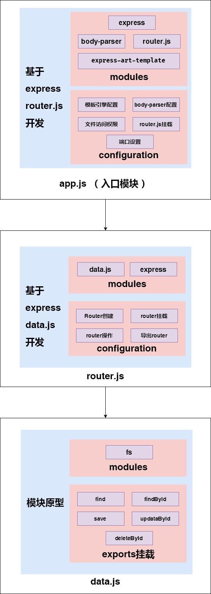

# Express crud

## 起步

- 初始化
- 模板处理

## 路由设计

| 请求方法 | 请求路径         | get参数 | post参数                   | 备注             |
| -------- | ---------------- | ------- | -------------------------- | ---------------- |
| GET      | /students        | -       | -                          | 渲染首页         |
| GET      | /students/new    | -       | -                          | 渲染添加学生页面 |
| POST     | /students/new    | -       | name,age,gender,hobbies    | 处理添加学生请求 |
| GET      | /students/edit   | id      | -                          | 渲染编辑页面     |
| POST     | /students/edit   | -       | id,name,age,gender,hobbies | 处理编辑请求     |
| GET      | /students/delete | id      | -                          | 处理删除请求     |

## 提取路由模块

router.js:

```js
/**
 * router.js 路由模块
 * 职责：
 *    处理路由
 *    根据不同请求方法 + 请求路径设置具体的请求处理函数
 */

// express 有专门包装路由的方式  => 简化操作
var express = require('express')

// - 创建一个路由容器
var router = express.Router()

// - 把路由都挂载都 router 路由容器中
router.get('/students', function(req, res) {
})

// 导出router
module.exports = router
```

app.js

```js
var router = require('./router')

// 把路由容器挂载到 app 服务中
app.use(router)
```

## 设计操作数据的API模块

```js
/**
 * student.js
 * 数据操作文件模块
 * 职责：操作文件中的数据，只处理数据，不关心业务
 */

/**
 * 获取所有学生列表
 * return []
 */
exports.find = function() {}
/**
 * 添加保存
 */
exports.save = function() {}
/**
 * 更新
 */
exports.updata = function() {}
/**
 * 删除
 */
exports.delete = function() {}
```


